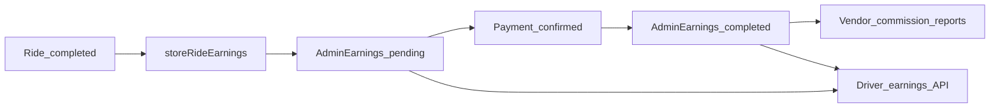

# Earnings system — Admin, Driver, and Vendor (backend reference)

This document is the **cross-role** reference for how money flows from a completed ride into **platform fee**, **driver share**, and **vendor commission**. For rider fare construction (base fare, distance, promos), see [COMPLETE_RIDE_CALCULATION_GUIDE.md](./COMPLETE_RIDE_CALCULATION_GUIDE.md). For driver-only formulas in isolation, see [DRIVER_EARNINGS_CALCULATION.md](./DRIVER_EARNINGS_CALCULATION.md). For vendor wallet and payout mechanics, see [VENDOR_EARNING_AND_PAYOUT_FLOW.md](./VENDOR_EARNING_AND_PAYOUT_FLOW.md).

---

## 1. Single source of truth: `AdminEarnings`

Each completed ride that produces a settlement row should have **at most one** document in the `AdminEarnings` collection, keyed by **`rideId`** (unique index).

| Field | Role |
|--------|------|
| `grossFare` | Final rider fare for that ride (`ride.fare`) at the time earnings were stored |
| `platformFee` | Platform (Cerca) share of `grossFare` |
| `driverEarning` | Driver’s share of `grossFare` (before vendor commission is taken from this conceptually for fleet drivers) |
| `driverId`, `riderId`, `rideDate` | Attribution and reporting windows |
| `vehicleSnapshot` | Vehicle metadata for vendor/fleet breakdowns |
| `paymentStatus` | `pending` \| `completed` \| `failed` \| `refunded` — **see section 4** |
| `settlementType` | e.g. normal completion vs special cases |
| `vendorFineCredit` | Optional adjustment surfaced in vendor reporting |
| `riderPenaltyAmount` | Optional penalty metadata |

**Schema:** [Models/Admin/adminEarnings.model.js](./Models/Admin/adminEarnings.model.js)

---

## 2. Global split: Admin Settings

Percentages are read from **Settings** (singleton / `findOne()`):

- `pricingConfigurations.platformFees` — platform take (e.g. 20 means 20%)
- `pricingConfigurations.driverCommissions` — driver pool (e.g. 80 means 80%)

**Schema:** [Models/Admin/settings.modal.js](./Models/Admin/settings.modal.js) (filename as in repo)

Product expectation: **platformFees + driverCommissions ≈ 100%** of the fare split; the code also supports a fallback when `driverCommissions` is not set.

---

## 3. Core formulas (per ride, after final `ride.fare`)

Let `grossFare = ride.fare` (final amount the rider pays for the ride, after discounts, etc. — see the ride calculation guide).

```text
platformFee   = grossFare × (platformFees / 100)
driverEarning = grossFare × (driverCommissions / 100)   // when driverCommissions is set
              OR grossFare - platformFee                 // fallback when driverCommissions is falsy
```

**Rounding:** Values are rounded to **two decimal places**. Implementation adjusts `driverEarning` if needed so that `platformFee + driverEarning` matches `grossFare` within a small tolerance (see `storeRideEarnings`).

**Implementation:** [utils/socket.js](./utils/socket.js) — function `storeRideEarnings`, including the reconciliation block after platform/driver amounts are computed.

---

## 4. When `AdminEarnings` is created

- **Function:** `storeRideEarnings(ride)` in [utils/socket.js](./utils/socket.js).
- **When:** Invoked from the ride-completion / payment pipeline after a ride is completed and fare is available (same file — search for calls to `storeRideEarnings`).
- **Initial state:** New rows are created with **`paymentStatus: 'pending'`** by default.
- **Idempotency:** If a row already exists for `rideId`, the function exits without duplicating.

---

## 5. `paymentStatus` lifecycle (critical)

Vendor-facing revenue and reports **filter** `AdminEarnings` to **`paymentStatus === 'completed'`** only. Driver APIs often **show all rows** but **split totals** into pending vs completed. The **admin dashboard aggregate** today sums **all** rows in the date range **without** filtering by `paymentStatus` — see section 7.

### 5.1 Who sets `AdminEarnings.paymentStatus` to `completed`?

| Flow | Where |
|------|--------|
| **Cash** — driver marks cash collected | [Controllers/Driver/driver.controller.js](./Controllers/Driver/driver.controller.js) — updates `Ride` and matching `AdminEarnings` when cash is confirmed |
| **Razorpay / online / wallet** | [Controllers/payment.controller.js](./Controllers/payment.controller.js), [Controllers/User/wallet.controller.js](./Controllers/User/wallet.controller.js), and ride/socket completion paths in [utils/socket.js](./utils/socket.js) — `ride.paymentStatus` and related logic; ensure any path that should settle `AdminEarnings` also updates `AdminEarnings.paymentStatus` where implemented |
| **Admin driver payout completed** | [Controllers/Admin/payments.controller.js](./Controllers/Admin/payments.controller.js) — `processPayout`: when payout `status === 'COMPLETED'`, `AdminEarnings.updateMany` sets `paymentStatus: 'completed'` for related `relatedEarnings` IDs |
| **Admin / verification tools** | [Routes/admin.routes.js](./Routes/admin.routes.js) — earnings verification, bulk status, backfill (see `earningsVerification.controller`, `driverEarnings.controller`) |

Always verify the latest code paths when adding a new payment method.

### 5.2 Vendor queries

[Controllers/Vendor/vendor.controller.js](./Controllers/Vendor/vendor.controller.js) — `buildVendorEarningsFilter` includes `paymentStatus: 'completed'` when building the `AdminEarnings` query for vendor reports.

---

## 6. Vendor earnings (commission on driver’s share)

Vendor commission is **not** taken from `grossFare` directly. It is taken from the **driver’s share** (`driverEarning` on `AdminEarnings`), for rows that pass the vendor filter (including **`completed`** payment).

**Function:** `calculateVendorCommission(vendor, driverEarning)` in [Controllers/Vendor/vendor.controller.js](./Controllers/Vendor/vendor.controller.js)

- **`PERCENTAGE`:** `vendorCommission = driverEarning × (commissionValue / 100)`
- **`FIXED`:** `vendorCommission = min(commissionValue, driverEarning)`

Optional **`vendorFineCredit`** on an earning row is included in vendor revenue / vehicle profit breakdowns as documented in [VENDOR_EARNING_AND_PAYOUT_FLOW.md](./VENDOR_EARNING_AND_PAYOUT_FLOW.md).

**Reporting helpers:** `getVendorEarningsReportData`, `buildVendorDriverRevenueMetrics`, `getVendorEarningsReport`, driver-wise endpoints — same controller and [Routes/Vendor/vendor.routes.js](./Routes/Vendor/vendor.routes.js).

---

## 7. Driver earnings

### 7.1 Primary API (dashboard-style data from `AdminEarnings`)

- **Route:** `GET /drivers/:driverId/earnings`  
- **Mount:** [index.js](./index.js) — `app.use('/drivers', require('./Routes/Driver/earnings.routes'))`  
- **Controller:** [Controllers/Driver/earnings.controller.js](./Controllers/Driver/earnings.controller.js) — `getDriverEarnings`

Behaviour (summary):

- Query `AdminEarnings` for the driver with optional **period** (`today`, `week`, `month`, `year`, `all`) or **startDate/endDate**.
- Aggregate **gross**, **platform**, **driver** totals from stored rows.
- Split **pending** vs **completed** `driverEarning` by `paymentStatus`.
- **Tips:** Loaded from linked `Ride` documents (`tips` field) and added into **net** presentation for the driver.

### 7.2 Legacy / alternate endpoint

[Controllers/Driver/driver.controller.js](./Controllers/Driver/driver.controller.js) — some handlers recompute totals from **completed `Ride`** documents and settings percentages (see [DRIVER_EARNINGS_CALCULATION.md](./DRIVER_EARNINGS_CALCULATION.md)). Prefer **`AdminEarnings`**-backed APIs for consistency with platform/vendor accounting unless the product explicitly requires recomputation from rides.

---

## 8. Admin revenue (dashboard)

- **Route:** `GET /admin/dashboard`  
- **Mount:** [Routes/Admin/dashboard.routes.js](./Routes/Admin/dashboard.routes.js) on `/admin`  
- **Controller:** [Controllers/Admin/dashboard.controller.js](./Controllers/Admin/dashboard.controller.js) — `getDashboard`

The **revenue** aggregation uses `AdminEarnings.aggregate` with an optional **date range on `rideDate` only**. It does **not** filter by `paymentStatus`.

**Implication for implementers:** Dashboard totals (`totalPlatformEarnings`, `totalGrossFare`, `totalDriverEarnings`) may include rows that are still **`pending`** or otherwise not settled. **Vendor** totals use **`completed` only**. If the admin earnings UI must match vendor reporting rules, add an explicit `paymentStatus: 'completed'` filter (product decision).

### 8.1 Other admin earnings APIs

Mounted under `/admin` from [Routes/admin.routes.js](./Routes/admin.routes.js), including:

- `GET /admin/earnings` — analytics
- `GET /admin/drivers/earnings`, `GET /admin/drivers/:driverId/earnings`, stats, analytics
- PATCH endpoints for bulk/single earning status
- Verification / backfill / validate tools

See that file for the exact list.

---

## 9. Vendor app (authenticated vendor)

Base path: **`/vendor`** ([index.js](./index.js)).

Notable routes from [Routes/Vendor/vendor.routes.js](./Routes/Vendor/vendor.routes.js):

| Method | Path | Purpose |
|--------|------|---------|
| GET | `/vendor/dashboard/:vendorId` | Vendor dashboard stats |
| GET | `/vendor/earnings-report` | Earnings report (query: date range) |
| GET | `/vendor/driver-wise-earnings` | Driver-wise breakdown |
| GET | `/vendor/payout/available-balance` | Available balance |
| POST | `/vendor/payout/request` | Request payout |

(Requires vendor JWT where `authenticateVendor` is applied.)

---

## 10. Payment processing (admin)

Base path: **`/admin`** + [Routes/Admin/payments.routes.js](./Routes/Admin/payments.routes.js)

Examples:

- `GET /admin/payments`
- `PATCH /admin/payments/payouts/:id/process` — driver payout processing (`processPayout` in [Controllers/Admin/payments.controller.js](./Controllers/Admin/payments.controller.js))
- Vendor payout listing/processing under `/admin/payments/vendor-payouts` and `/admin/vendors` routes as configured

---

## 11. End-to-end flow (mermaid)



---

## 12. Implementing the main earnings UI (checklist)

1. **Clarify product rules** for “recognized revenue”: use **`paymentStatus`** consistently or document why admin shows gross-all vs vendor shows completed-only.
2. **Driver UI:** Show **settled vs pending** driver share when using `AdminEarnings`; include **tips** from `Ride` if the product requires them (see `earnings.controller.js`).
3. **Vendor UI:** Use only **`completed`** `AdminEarnings` rows for commission and wallet (per vendor flow doc).
4. **Admin UI:** If parity with vendor is required, filter aggregates by **`paymentStatus: 'completed'`** or add a toggle “All records” vs “Settled only”.
5. **Audit:** Use admin verification/backfill routes during migration or data fixes — see `/admin` earnings routes in [Routes/admin.routes.js](./Routes/admin.routes.js).

---

## 13. Related files (quick index)

| Area | File |
|------|------|
| Store ride earnings | [utils/socket.js](./utils/socket.js) (`storeRideEarnings`) |
| Vendor commission & reports | [Controllers/Vendor/vendor.controller.js](./Controllers/Vendor/vendor.controller.js) |
| Driver earnings API | [Controllers/Driver/earnings.controller.js](./Controllers/Driver/earnings.controller.js) |
| Admin dashboard revenue | [Controllers/Admin/dashboard.controller.js](./Controllers/Admin/dashboard.controller.js) |
| Admin payouts | [Controllers/Admin/payments.controller.js](./Controllers/Admin/payments.controller.js) |
| Driver cash collection | [Controllers/Driver/driver.controller.js](./Controllers/Driver/driver.controller.js) |
| Backfill utility | [utils/backfillEarnings.js](./utils/backfillEarnings.js) |

---

*Last updated to reflect backend layout as of the `EARNINGS_SYSTEM` documentation task. When changing settlement rules, update this file and the linked domain docs.*
