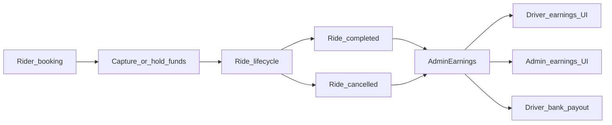

# Earnings system — Admin, Driver, and Vendor (backend reference)

This document is the **cross-role** reference for how money flows from a ride into **platform fee**, **driver share**, **vendor commission**, **rider funds**, **bank payouts**, and **cash remittance**. For rider fare construction (base fare, distance, promos), see [COMPLETE_RIDE_CALCULATION_GUIDE.md](./COMPLETE_RIDE_CALCULATION_GUIDE.md). For driver-only formulas in isolation, see [DRIVER_EARNINGS_CALCULATION.md](./DRIVER_EARNINGS_CALCULATION.md). For vendor wallet and payout mechanics, see [VENDOR_EARNING_AND_PAYOUT_FLOW.md](./VENDOR_EARNING_AND_PAYOUT_FLOW.md). For driver payout API detail, see [DRIVER_EARNINGS_AND_PAYOUT_API_DOCUMENTATION.md](./DRIVER_EARNINGS_AND_PAYOUT_API_DOCUMENTATION.md).

---

## 0. Rider payment timing (current implementation)

Truth table aligned with the rider app ([Cerca/src/app/pages/payment/payment.page.ts](../../Cerca/src/app/pages/payment/payment.page.ts)) and backend ([utils/socket.js](./utils/socket.js) `newRideRequest`, [utils/walletRideSettlement.js](./utils/walletRideSettlement.js), cancellation helpers in [utils/ride_booking_functions.js](./utils/ride_booking_functions.js)).

| Method | At booking | At ride completion | Notes |
|--------|------------|-------------------|--------|
| **CASH** | No wallet/gateway charge | Rider pays driver offline; driver may call `mark-cash-collected` | No prepaid rider funds. |
| **WALLET** (pure) | Backend **deducts full fare** after `createRide` (socket block “pure WALLET payment deduction upfront”). Rider UI may still say “at completion”; server is source of truth. | If no upfront txn exists (legacy rides), completion path deducts; then `settleWalletRideCompletionFare` adjusts **delta** vs final fare | Idempotent via existing `RIDE_PAYMENT` on `relatedRide`. |
| **RAZORPAY** (no `razorpayPaymentId`) | Ride created; **post-ride** payment | Gateway charged after trip (see rider `handlePayOnlinePayment`) | Verified only when `razorpayPaymentId` present at booking. |
| **Hybrid** (`walletAmountUsed` + `razorpayPaymentId`) | Wallet part deducted + Razorpay verified | Same as wallet delta settlement for wallet portion if fare changes | See hybrid block in `newRideRequest`. |

**Feature flags (Settings `paymentFeatures`):** `prepaidWalletEnabled` (default true — wallet upfront is server default), `prepaidRazorpayEnabled` (default false — when true, rider app should send `razorpayPaymentId` for full fare at booking).

---

## 1. Single source of truth: `AdminEarnings`

Each ride that produces a settlement row should have **at most one** document in the `AdminEarnings` collection, keyed by **`rideId`** (unique index).

| Field | Role |
|--------|------|
| `grossFare` | Final rider fare for that ride (`ride.fare`) at the time earnings were stored |
| `platformFee` | Platform (Cerca) share of `grossFare` |
| `driverEarning` | Driver’s share of `grossFare` (before vendor commission is taken from this conceptually for fleet drivers) |
| `driverId`, `riderId`, `rideDate` | Attribution and reporting windows |
| `vehicleSnapshot` | Vehicle metadata for vendor/fleet breakdowns |
| `paymentStatus` | `pending` \| `completed` \| `failed` \| `refunded` — **rider-side / vendor settlement** (see §5 and §14) |
| `settlementType` | `completed` (normal), `rider_cancel_before_start_otp`, `driver_cancel_in_progress`, … |
| `vendorFineCredit` | Optional adjustment surfaced in vendor reporting |
| `riderPenaltyAmount` | Optional penalty metadata |
| `riderFundsStatus` | `none` \| `authorized` \| `captured` \| `refunded` \| `partially_refunded` — rider money lifecycle |
| `driverPayoutEligible` | Legacy / reporting flag; **bank payout** uses [utils/driverNetSettlementBalance.js](./utils/driverNetSettlementBalance.js) (non-cash credits minus outstanding cash receivables), not this flag alone |
| `cashPlatformReceivable` | Subdocument: platform fee owed by driver on **cash** rides until collected |
| `cancellationFeeSplit` | Optional retained cancellation fee split (platform vs driver %) for transparency |

**Schema:** [Models/Admin/adminEarnings.model.js](./Models/Admin/adminEarnings.model.js)

---

## 2. Global split: Admin Settings

Percentages are read from **Settings** (singleton / `findOne()`):

- `pricingConfigurations.platformFees` — platform take (e.g. 20 means 20%)
- `pricingConfigurations.driverCommissions` — driver pool (e.g. 80 means 80%)
- `cancellationSettlement.cancellationFeeSplitPlatformPercent` / `cancellationFeeSplitDriverPercent` — split of **cancellation fee retained** (must sum to 100)

**Schema:** [Models/Admin/settings.modal.js](./Models/Admin/settings.modal.js)

Product expectation: **platformFees + driverCommissions ≈ 100%** of the fare split; the code also supports a fallback when `driverCommissions` is not set.

---

## 3. Core formulas (per ride, after final `ride.fare`)

Let `grossFare = ride.fare` (final amount the rider pays for the ride, after discounts, etc.).

```text
platformFee   = grossFare × (platformFees / 100)
driverEarning = grossFare × (driverCommissions / 100)   // when driverCommissions is set
              OR grossFare - platformFee                 // fallback when driverCommissions is falsy
```

**Rounding:** Values are rounded to **two decimal places**. Implementation adjusts `driverEarning` if needed so that `platformFee + driverEarning` matches `grossFare` within a small tolerance (see `storeRideEarnings`).

**Implementation:** [utils/socket.js](./utils/socket.js) — function `storeRideEarnings`.

---

## 4. When `AdminEarnings` is created (normal completion)

- **Function:** `storeRideEarnings(ride)` in [utils/socket.js](./utils/socket.js).
- **When:** Invoked from the ride-completion pipeline after a ride is completed and fare is available.
- **Initial state:** Sets **`paymentStatus`** and **`riderFundsStatus`** from the ride (non-cash settled rides → vendor-complete; cash → pending until driver confirms collection). Sets **`driverPayoutEligible`** per §14. Initializes **`cashPlatformReceivable`** for cash rides.
- **Idempotency:** If a row already exists for `rideId`, the function exits without duplicating.

---

## 5. `paymentStatus` on `AdminEarnings` (vendor / rider settlement)

Vendor-facing revenue and reports **filter** `AdminEarnings` to **`paymentStatus === 'completed'`** in several vendor queries. This field should mean **“rider payment is settled with the platform definition”** (wallet captured, gateway captured, or cash collected from rider).

### 5.1 Who sets `AdminEarnings.paymentStatus` to `completed`?

| Flow | Where |
|------|--------|
| **Cash** — driver marks cash collected | [Controllers/Driver/driver.controller.js](./Controllers/Driver/driver.controller.js) — `markCashCollected` |
| **Wallet / Razorpay / hybrid** | Ride + wallet paths in [utils/socket.js](./utils/socket.js); [Controllers/payment.controller.js](./Controllers/payment.controller.js); [Controllers/User/wallet.controller.js](./Controllers/User/wallet.controller.js) |
| **Cancellation settlements** | [utils/ride_booking_functions.js](./utils/ride_booking_functions.js) — `creditDriverForBeforeStartCancel`, `finalizeDriverInProgressCancelLedger` |
| **Admin earnings PATCH / verification** | [Routes/admin.routes.js](./Routes/admin.routes.js), `driverEarnings.controller`, `earningsVerification.controller` |

**Important:** Driver **bank payout** processing must **not** overload this field. Payout completion is tracked via **`Payout.relatedEarnings`** and **`driverPayoutEligible`** (see §14).

### 5.2 Vendor queries

[Controllers/Vendor/vendor.controller.js](./Controllers/Vendor/vendor.controller.js) — `buildVendorEarningsFilter` includes `paymentStatus: 'completed'` when building the `AdminEarnings` query for vendor reports.

---

## 6. Vendor earnings (commission on driver’s share)

Vendor commission is taken from the **driver’s share** (`driverEarning` on `AdminEarnings`), for rows that pass the vendor filter (including **`completed`** payment).

**Function:** `calculateVendorCommission(vendor, driverEarning)` in [Controllers/Vendor/vendor.controller.js](./Controllers/Vendor/vendor.controller.js)

---

## 7. Driver earnings

### 7.1 Primary API

- **Route:** `GET /drivers/:driverId/earnings`  
- **Controller:** [Controllers/Driver/earnings.controller.js](./Controllers/Driver/earnings.controller.js) — `getDriverEarnings`

Includes **`paymentMethod`**, **`platformFeePercent`**, **`driverCommissionPercent`**, **`cashPlatformReceivable`**, **`cancellationFeeSplit`**, and summaries **`cashOwedToPlatformTotal`** / **`payoutEligibleTotals`**.

### 7.2 Cash owed to platform (driver)

- **Route:** `GET /drivers/:driverId/earnings/cash-owed-summary`  
- **Controller:** same file — aggregates outstanding `cashPlatformReceivable`.

### 7.3 Driver app

Flutter: [driver_cerca/lib/screens/earnings_screen.dart](../../driver_cerca/lib/screens/earnings_screen.dart); socket `driverEarningAdded` (gross, platform, driver share).

---

## 8. Admin revenue (dashboard)

- **Route:** `GET /admin/dashboard` — [Controllers/Admin/dashboard.controller.js](./Controllers/Admin/dashboard.controller.js)

Aggregates may include all rows unless filtered; align product rules with vendor if needed.

### 8.1 Driver earnings & cash receivables

- `GET /admin/drivers/:driverId/earnings` — [Controllers/Admin/driverEarnings.controller.js](./Controllers/Admin/driverEarnings.controller.js)
- `GET /admin/drivers/cash-receivables` — list outstanding cash platform receivables
- `PATCH /admin/drivers/earnings/:earningId/cash-platform-collect` — record physical collection

---

## 9. Vendor app (authenticated vendor)

Base path: **`/vendor`** ([index.js](./index.js)). See [Routes/Vendor/vendor.routes.js](./Routes/Vendor/vendor.routes.js).

---

## 10. Payment processing (admin)

Base path: **`/admin`** + [Routes/Admin/payments.routes.js](./Routes/Admin/payments.routes.js)

- `PATCH /admin/payments/payouts/:id/process` — `processPayout` updates payout status; **does not** flip `AdminEarnings.paymentStatus` (payout is orthogonal to vendor settlement).

---

## 11. Refund / cancellation (operations summary)

Automatic paths in [utils/ride_booking_functions.js](./utils/ride_booking_functions.js):

- **`processWalletRefund`** — WALLET; refund = fare − cancellation fee when `RIDE_PAYMENT` exists; updates ride `paymentStatus` `refunded`.
- **`processRazorpayRefund`** — gateway refund when `razorpayPaymentId` present.
- **Driver in-progress cancel** — `driverInProgressCancelSettlement`, `finalizeDriverInProgressCancelLedger`, rider wallet / Razorpay / cash acknowledgement flows.
- **Before-start OTP rider cancel** — prepaid split, possible driver credit via `creditDriverForBeforeStartCancel`.

When a cancellation fee is retained from prepaid funds and Settings define **`cancellationFeeSplit*`**, the backend records **`cancellationFeeSplit`** on the relevant `AdminEarnings` row for driver/admin UI.

---

## 12. End-to-end flow (mermaid)



---

## 13. Related files (quick index)

| Area | File |
|------|------|
| Store ride earnings | [utils/socket.js](./utils/socket.js) (`storeRideEarnings`) |
| Wallet fare delta | [utils/walletRideSettlement.js](./utils/walletRideSettlement.js) |
| Cancellations / refunds | [utils/ride_booking_functions.js](./utils/ride_booking_functions.js) |
| Vendor commission & reports | [Controllers/Vendor/vendor.controller.js](./Controllers/Vendor/vendor.controller.js) |
| Driver earnings API | [Controllers/Driver/earnings.controller.js](./Controllers/Driver/earnings.controller.js) |
| Driver payout / net ledger | [Controllers/Driver/payout.controller.js](./Controllers/Driver/payout.controller.js), [utils/driverNetSettlementBalance.js](./utils/driverNetSettlementBalance.js) |
| Admin dashboard revenue | [Controllers/Admin/dashboard.controller.js](./Controllers/Admin/dashboard.controller.js) |
| Admin payouts | [Controllers/Admin/payments.controller.js](./Controllers/Admin/payments.controller.js) |
| Driver cash collection | [Controllers/Driver/driver.controller.js](./Controllers/Driver/driver.controller.js) |
| Admin cash receivable | [Controllers/Admin/driverEarnings.controller.js](./Controllers/Admin/driverEarnings.controller.js) |

---

## 14. Driver bank payout balance (net settlement ledger)

**`paymentStatus`** = rider/vendor settlement only. Payout completion does **not** mutate **`paymentStatus`**; settled rides are excluded from the net by **`Payout.relatedEarnings`** (PENDING, PROCESSING, COMPLETED).

**Net settlement balance** (see [utils/driverNetSettlementBalance.js](./utils/driverNetSettlementBalance.js)):

- **Non-cash rides** (WALLET, RAZORPAY, hybrid, etc.): for each completed earning not yet on a payout, add **`driverEarning` + ride `tips`** (company owes the driver this bank credit).
- **Cash rides**: the driver keeps fare offline; **never** add **`driverEarning`** toward bank payout. If **`cashPlatformReceivable.status === 'outstanding'`**, subtract **`cashPlatformReceivable.amount`** (driver owes the platform that commission). When admin marks fee collected (`settled`), that subtraction goes away; there is still **no** bank credit for the cash ride’s driver share.

**`driverPayoutEligible`** remains on documents for legacy/reporting but **bank payout math** uses payment method (prefer **`paymentMethodSnapshot`** on `AdminEarnings`, else ride) and the rules above—not “flip eligible after cash fee collected.”

**`paymentMethodSnapshot`** is set when earnings are stored or synced from the ride so payout logic does not depend on extra queries.

---

## 15. Implementing UIs (checklist)

1. **Driver:** Show **net settlement** (signed), **payoutable** cap, and cash owed to platform; show cancellation fee split when present.
2. **Admin:** Receivables list + collect action; driver payouts attach **non-cash** `relatedEarnings` only.
3. **Vendor:** Continue using **`paymentStatus: 'completed'`** for commission.
4. **Audit:** Verification routes under `/admin/earnings/*`.

---

*Last updated: earnings + payment modes + payout semantics + cash remittance. Keep in sync with code changes.*
