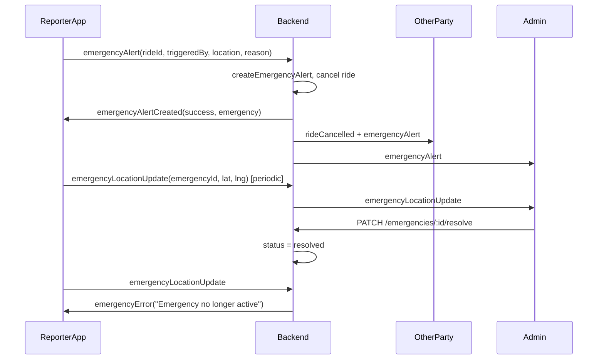

# Emergency System – Backend Reference

This document is the canonical reference for the backend emergency (SOS) system. Use it when implementing or debugging the emergency flow in the **driver app** (Flutter) and **user app** (Ionic/Angular).

---

## 1. Overview

During an active ride, the **rider** or **driver** can trigger an SOS. The backend:

1. Creates an emergency record and cancels the ride.
2. Notifies the rider, driver, and admins via sockets (`rideCancelled` + `emergencyAlert`).
3. Allows the **reporter** (who triggered) to send periodic live location updates to admins.
4. When an admin **resolves** the emergency (REST), status becomes non-active and further location updates are rejected with `emergencyError` ("Emergency no longer active"). Client apps should stop sending updates and show a single “resolved” message.



---

## 2. Data Model

**Emergency** – `Models/User/emergency.model.js`

| Field | Type | Description |
|-------|------|-------------|
| `ride` | ObjectId (ref Ride) | Required. The ride during which the emergency was triggered. |
| `triggeredBy` | ObjectId (refPath) | Required. User or Driver who triggered. |
| `triggeredByModel` | String | Required. `'User'` or `'Driver'`. |
| `location` | GeoJSON Point | `{ type: 'Point', coordinates: [lng, lat] }`. |
| `reason` | String | Required. Enum: `accident`, `harassment`, `unsafe_driving`, `medical`, `other`. |
| `description` | String | Optional, max 500 chars. |
| `status` | String | `active` \| `resolved` \| `dismissed`. Default `active`. |
| `resolvedAt` | Date | Set when status becomes `resolved`. |
| `createdAt` | Date | Default `Date.now`. |

**Important:** When `status` is not `active`, the backend rejects `emergencyLocationUpdate` and sends `emergencyError` with message `"Emergency no longer active"`. Client apps must stop sending location updates and handle this message once (e.g. show “Emergency has been resolved” and stop the interval).

---

## 3. REST API (HTTP)

Base path: **`/emergencies`** (mounted in `index.js`; routes in `Routes/User/emergency.routes.js`).

| Method | Path | Description | Request / Response |
|--------|------|-------------|--------------------|
| POST | `/` | Create emergency (also used via socket flow). | Body: `rideId`, `triggeredBy`, `triggeredByModel`, `location`, `reason`, `description?`. Response: `201` + `{ message, emergency }`. |
| GET | `/` | Get all emergencies (admin). | Query: `status`, `limit`, `skip`. Response: `{ emergencies, total, count }`. |
| GET | `/active` | Get active emergencies only. | Response: `{ emergencies, count }`. |
| GET | `/:id` | Get one emergency by ID. | Response: `{ emergency }`. |
| GET | `/ride/:rideId` | Get emergencies for a ride. | Response: `{ emergencies, count }`. |
| GET | `/user/:userId` | Get emergencies by user/driver. | Query: `userModel=User` or `userModel=Driver`. Response: `{ emergencies, count }`. |
| PATCH | `/:id/resolve` | Set status to `resolved` (admin). | Response: `{ message, emergency }` (updated emergency with `resolvedAt`). |
| PATCH | `/:id/dismiss` | Set status to `dismissed`. | Response: `{ message, emergency }`. |
| DELETE | `/:id` | Delete emergency (admin). | Response: `{ message }`. |

---

## 4. Socket Events Reference

| Event | Direction | Who | Payload / Conditions | Purpose |
|-------|-----------|-----|----------------------|--------|
| **emergencyAlert** | Client → Server | User app or Driver app | `rideId`, `triggeredBy` (userId or driverId), `triggeredByModel` ('User' \| 'Driver'), `location` (e.g. `{ latitude, longitude }` or `{ type: 'Point', coordinates: [lng, lat] }`), `reason` (enum), `description` (optional). | Trigger SOS. Server creates emergency, cancels ride, then emits to rider, driver, ride room, and admin rooms; then sends **emergencyAlertCreated** to this socket. |
| **emergencyAlertCreated** | Server → Client | Reporter only | `{ success: true, emergency }`. | Confirmation to the socket that emitted **emergencyAlert**. Client should start periodic **emergencyLocationUpdate** when `success` and `emergency._id` are present. |
| **emergencyError** | Server → Client | Any client | `{ message: string }`. | Sent when **emergencyAlert** fails or when **emergencyLocationUpdate** is rejected. Known messages: `"Emergency no longer active"`, `"Only the reporter can send location updates"`, `"Emergency not found"`, `"emergencyId, latitude, longitude required"`. Client should stop location updates and show a single message for “no longer active”. |
| **emergencyAlert** | Server → Client (broadcast) | Rider, Driver, Admin | Full emergency document. | Sent to ride `userSocketId`, ride `driverSocketId`, ride room `ride_<rideId>`, and rooms `admin` and `admin_support_online`. Other party and admins use this to show “Emergency triggered” and details. |
| **rideCancelled** | Server → Client | Rider, Driver | `{ rideId, ride, reason, cancelledBy }`. `reason` is e.g. `"Emergency: harassment"`. | Emitted when emergency is created. Both apps must clear ride state and leave active-ride UI. **Handle once per ride** (single-shot) to avoid multiple Navigator pops from duplicate events. |
| **emergencyLocationUpdate** | Client → Server | Reporter (User or Driver) | `emergencyId`, `latitude` (number), `longitude` (number), `timestamp` (optional ISO string). | Send live location. Server checks: emergency exists, `status === 'active'`, and socket is the reporter (`socket.data.userId` or `socket.data.driverId` matches `emergency.triggeredBy`). On success: broadcast to `admin` and to room `emergency_<emergencyId>`. On failure: `socket.emit('emergencyError', { message })`. |
| **emergencyLocationUpdate** | Server → Client | Admin (and sockets in `emergency_<id>`) | `{ emergencyId, latitude, longitude, timestamp }`. | Live location broadcast. Received by sockets in `admin` room and in `emergency_<emergencyId>` (admins that joined via **emergency:join**). |
| **emergency:join** | Client → Server | Admin only | `{ emergencyId }`. | Server checks socket is in `admin` or `admin_support_online`, then `socket.join('emergency_' + emergencyId)`. Use so admin dashboard can receive live updates for one emergency. |
| **emergency:leave** | Client → Server | Admin | `{ emergencyId }`. | `socket.leave('emergency_' + emergencyId)`. |

---

## 5. Client Connection Context

- **Rider:** Socket must be identified with `userId` (e.g. `socket.data.userId` set on `riderConnect`). Required for **emergencyAlert** (`triggeredBy`) and for **emergencyLocationUpdate** (reporter check).
- **Driver:** Socket must be identified with `driverId` (e.g. `socket.data.driverId` set when driver connects). Same for **emergencyAlert** and **emergencyLocationUpdate**.
- **Admin:** Socket joins room `admin` or `admin_support_online` to receive **emergencyAlert** and **emergencyLocationUpdate** for all emergencies. Use **emergency:join** `{ emergencyId }` to subscribe to one emergency’s live updates.

---

## 6. User App (Rider) Flow

1. **Trigger:** User taps SOS during active ride → emit **emergencyAlert** with `rideId`, `triggeredBy` (user id), `triggeredByModel: 'User'`, `location`, `reason`, `description`.
2. **On emergencyAlertCreated** (success, `emergency._id`): Start periodic **emergencyLocationUpdate**(emergencyId, lat, lng); clear ride state and navigate away from active ride.
3. **On emergencyError:** If `message` contains `"no longer active"`, stop location updates and show a single “Emergency has been resolved” (no repeated toasts).
4. **On emergencyAlert** (incoming): Other party (driver) triggered; show alert and clear ride state.
5. **On rideCancelled** (with Emergency reason): Clear ride state and pop active screen **once** (guard against duplicate events).

---

## 7. Driver App Flow

1. **Trigger:** Driver taps emergency → emit **emergencyAlert** with `rideId`, `triggeredBy` (driver id), `triggeredByModel: 'Driver'`, `location`, `reason`, `description`.
2. **On emergencyAlertCreated** (success, `emergency._id`): Start periodic **emergencyLocationUpdate**; clear ride state and leave active ride screen.
3. **On emergencyError:** Same as user app: stop updates, handle “no longer active” once.
4. **On emergencyAlert** (incoming): Rider triggered; show “Emergency from rider” and ride ID. Use payload `ride` or `rideId` for display (server may send `ride` as the ID value). Clear ride state and pop **once** (single-shot **rideCancelled** handling).

---

## 8. Admin Flow (Reference)

1. Join admin room to receive **emergencyAlert** and **emergencyLocationUpdate** for all emergencies.
2. To get live updates for **one** emergency: emit **emergency:join** `{ emergencyId }`; then listen for **emergencyLocationUpdate** (same payload). Optionally **emergency:leave** `{ emergencyId }` when closing the incident view.
3. **Resolve:** `PATCH /emergencies/:id/resolve`. After that, `emergency.status` is not `active`; the reporter’s next **emergencyLocationUpdate** will receive **emergencyError** `"Emergency no longer active"`. Clients must stop sending and show resolved once.

---

## 9. Payload Examples

**Minimal emergencyAlert (emit from client):**

```json
{
  "rideId": "698c584539415bfb6716d884",
  "triggeredBy": "697f14ae06e8406e7269cfef",
  "triggeredByModel": "User",
  "location": { "latitude": 18.621, "longitude": 73.709 },
  "reason": "harassment"
}
```

**emergencyAlertCreated (server → reporter):**

```json
{
  "success": true,
  "emergency": {
    "_id": "698c585739415bfb6716d8b9",
    "ride": "698c584539415bfb6716d884",
    "triggeredBy": "697f14ae06e8406e7269cfef",
    "triggeredByModel": "User",
    "location": { "type": "Point", "coordinates": [73.709, 18.621] },
    "reason": "harassment",
    "status": "active",
    "createdAt": "2026-02-11T10:22:15.595Z"
  }
}
```

**emergencyLocationUpdate (emit from reporter):**

```json
{
  "emergencyId": "698c585739415bfb6716d8b9",
  "latitude": 18.432,
  "longitude": 73.8983936,
  "timestamp": "2026-02-11T10:27:06.611Z"
}
```

**emergencyError (server → client):**

```json
{ "message": "Emergency no longer active" }
```

Other possible messages: `"Emergency not found"`, `"Only the reporter can send location updates"`, `"emergencyId, latitude, longitude required"`.

---

## 10. Backend Code References

| Area | File | Notes |
|------|------|--------|
| Socket handlers | `utils/socket.js` | **emergencyAlert**, **emergencyLocationUpdate**, **emergency:join**, **emergency:leave**. |
| createEmergencyAlert (used by socket) | `utils/ride_booking_functions.js` | `createEmergencyAlert`, `normalizeEmergencyLocation`. |
| REST controller | `Controllers/User/emergency.controller.js` | createEmergencyAlert, getAllEmergencies, getEmergencyById, resolveEmergency, dismissEmergency, getActiveEmergencies, etc. |
| REST routes | `Routes/User/emergency.routes.js` | Mounted at `/emergencies` in `index.js`. |
| Model | `Models/User/emergency.model.js` | Emergency schema and indexes. |

Use this document when attaching the emergency flow to the driver or user app and when handling **rideCancelled**, **emergencyError**, and **emergencyAlertCreated** correctly (single-shot cancel handling, stop updates on “no longer active”).
