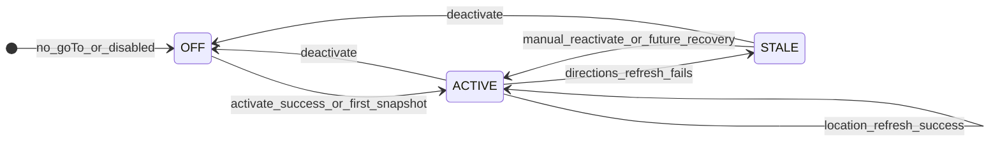
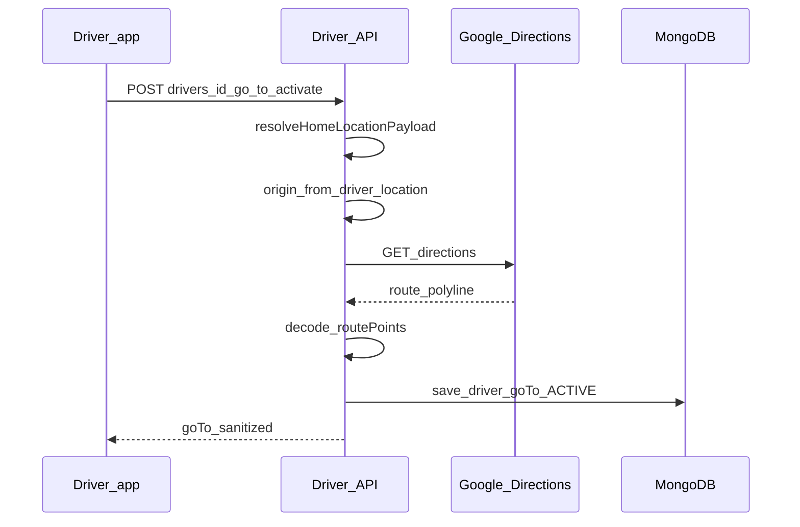
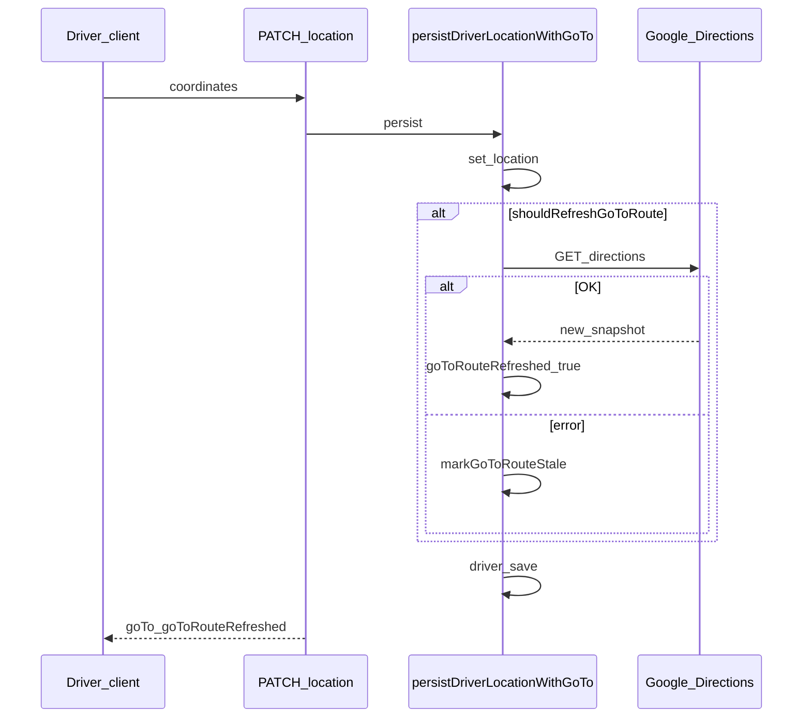
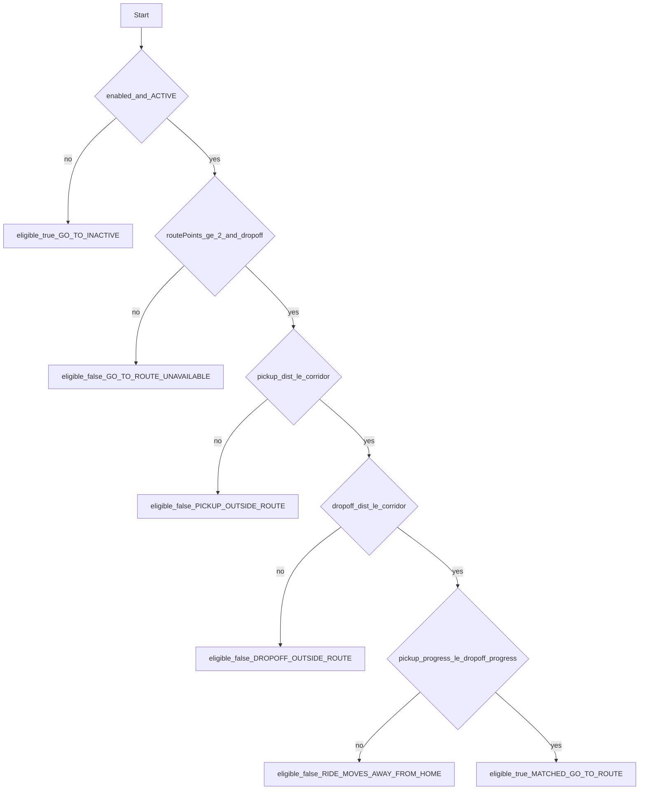

# Go-To functionality (end-to-end)

This document describes **Go-To**: how it is stored, computed, exposed over HTTP, refreshed as the driver moves, filtered during ride matching, and used in the driver Flutter app and admin panel.

Implementation anchors:

- Core logic: [`utils/goToRoute.service.js`](utils/goToRoute.service.js)
- Location + refresh orchestration: [`utils/driverLocationPersistence.js`](utils/driverLocationPersistence.js)
- HTTP handlers: [`Controllers/Driver/driver.controller.js`](Controllers/Driver/driver.controller.js)
- Routes: [`Routes/Driver/driver.routes.js`](Routes/Driver/driver.routes.js)
- Schema: [`Models/Driver/driver.model.js`](Models/Driver/driver.model.js)
- Nearby-driver filtering: [`utils/ride_booking_functions.js`](utils/ride_booking_functions.js) (e.g. `findNearbyDriversForRide` path with `dropoffLocation`)
- Driver app: [`driver_cerca/lib/services/go_to_service.dart`](../driver_cerca/lib/services/go_to_service.dart), [`go_to_state_model.dart`](../driver_cerca/lib/models/go_to_state_model.dart), [`go_to_screen.dart`](../driver_cerca/lib/screens/go_to_screen.dart)
- Admin map (full `routePoints`): [`cerca_admin/src/app/folder/pages/drivers/driver-detail/`](../cerca_admin/src/app/folder/pages/drivers/driver-detail/)

---

## 1. Overview

### Purpose

**Go-To** is a mode for drivers who are driving **toward a saved home (or end) location**. While Go-To is **active** and the server holds a valid **route polyline** from a recorded **origin** to **home**:

1. The platform may **refresh** that route as the driver’s GPS position moves (within thresholds).
2. When matching drivers to an instant ride request that includes a **drop-off** location, the server can **exclude** drivers whose Go-To route does not fit the trip:
   - Both **pickup** and **drop-off** must lie within a **corridor** (perpendicular distance) of the polyline.
   - The **drop-off** must be **no earlier along the route** than the pickup (progress toward home must not decrease) — i.e. the ride must not move the driver **away** from home along the stored path.

If Go-To is **off**, **stale**, or missing route data, eligibility rules behave as documented in [`isGoToRideEligible`](#37-isgotorideeligible).

### Non-goals

- The **user (rider) app** does not configure Go-To. There are no direct references in [`Controllers/User/ride.controller.js`](Controllers/User/ride.controller.js); matching uses server-side driver discovery in [`ride_booking_functions.js`](utils/ride_booking_functions.js).
- The **driver app** does not receive the full `routePoints` array in normal API responses (see [Sanitized vs full payload](#38-sanitizegotoresponse)).

---

## 2. Data model (`driver.goTo`)

Defined on the Driver document in [`Models/Driver/driver.model.js`](Models/Driver/driver.model.js).

| Field | Type / shape | Role |
|--------|----------------|------|
| `isEnabled` | Boolean | User intent to use Go-To (true after activation flow; false after deactivation). |
| `status` | `OFF` \| `ACTIVE` \| `STALE` | Runtime health of the route snapshot. |
| `staleReason` | String or null | e.g. `ROUTE_REFRESH_FAILED` when Directions refresh fails. |
| `homeAddress` | String | Human-readable home label. |
| `homeLocation` | GeoJSON `Point`, `coordinates: [lng, lat]` | Destination for routing. |
| `routeOrigin` | GeoJSON `Point` or null | Origin used for the **current** stored polyline (last successful snapshot). |
| `routePolyline` | String or null | Google **encoded** polyline (overview). |
| `routePoints` | `[[lng, lat], ...]` | Decoded polyline vertices used for geometry and eligibility. |
| `routeBounds` | `{ north, south, east, west }` or null | From Directions `bounds`. |
| `routeDistanceMeters` | Number or null | Leg distance from Directions. |
| `routeDurationSeconds` | Number or null | Leg duration from Directions. |
| `corridorRadiusMeters` | Number (default 500) | Half-width of the corridor for ride matching. |
| `activatedAt` | Date or null | When the mode was activated (carried through refreshes). |
| `lastRouteRefreshAt` | Date or null | When the polyline was last rebuilt successfully. |

**Coordinate order:** Throughout this subsystem, GeoJSON order **`[longitude, latitude]`** is used in `homeLocation`, `routeOrigin`, and each `routePoints[i]` pair.

---

## 3. Core service logic (`goToRoute.service.js`)

### 3.1 Constants

| Constant | Value | Meaning |
|----------|--------|---------|
| `DEFAULT_CORRIDOR_RADIUS_METERS` | `500` | Default corridor half-width for matching and for home upsert when body omits radius. |
| `ROUTE_REFRESH_DISTANCE_METERS` | `300` | Minimum movement from stored `routeOrigin` before a refresh is considered (with time gate). |
| `ROUTE_REFRESH_INTERVAL_MS` | `2 * 60 * 1000` (120000) | Minimum time since `lastRouteRefreshAt` before refresh (with distance gate). |

### 3.2 `buildGoToRouteSnapshot`

Async function: given `origin`, `destination`, optional `homeAddress`, `corridorRadiusMeters`, `activatedAt`:

1. Resolves **`GOOGLE_MAPS_API_KEY`** from environment, with a **hardcoded fallback** in code (production should set env only and rotate keys via GCP).
2. GET Google **Directions** API: driving, `alternatives=false`, origin/destination as `lat,lng` pairs built from normalized coordinates.
3. Reads first route’s `overview_polyline.points`, **decodes** to `routePoints` via `decodePolyline` (Google-encoded polyline algorithm; see `goToRoute.service.js`).
4. Returns an object suitable to assign to `driver.goTo`: `isEnabled: true`, `status: 'ACTIVE'`, `staleReason: null`, `homeLocation` / `routeOrigin` as Points, polyline, points, bounds, leg distance/duration, corridor radius, `activatedAt`, `lastRouteRefreshAt: new Date()`.

Throws if Directions status is not `OK`, no routes, or decoded points length &lt; 2.

**HTTP timeout** for the Directions request: 15 seconds (`httpsGetJson`).

### 3.3 `deactivateGoToState`

Merges into existing state: sets `isEnabled: false`, `status: 'OFF'`, clears `staleReason`, nulls/clears route fields (`routeOrigin`, `routePolyline`, `routePoints` → `[]`, bounds, distance, duration, `activatedAt`, `lastRouteRefreshAt`). Preserves other fields (e.g. `homeAddress` / `homeLocation`) unless the caller overwrites separately — the controller assigns the full return value of `deactivateGoToState` to `driver.goTo`.

### 3.4 `markGoToRouteStale`

Sets `status: 'STALE'`, `staleReason` (default `ROUTE_REFRESH_FAILED`), keeps `isEnabled: true`. Used when a **background refresh** throws (see [`driverLocationPersistence.js`](utils/driverLocationPersistence.js)) so the driver remains “in Go-To” but the route is not trusted until re-activated or fixed.

### 3.5 `shouldRefreshGoToRoute(currentGoTo, currentLocation)`

Returns `true` only if:

- `currentGoTo.isEnabled` and `currentGoTo.status === 'ACTIVE'`, and  
- Either **`routeOrigin` is missing**, or **both**:
  - Haversine distance from `routeOrigin.coordinates` to `currentLocation` ≥ `ROUTE_REFRESH_DISTANCE_METERS` (300 m), and  
  - `Date.now() - lastRouteRefreshAt` ≥ `ROUTE_REFRESH_INTERVAL_MS` (2 minutes).

So refresh is **throttled** by distance **and** time when an origin already exists.

### 3.6 `projectPointOnRoute(routePoints, pointLocation)`

For a point as `{ coordinates: [lng, lat] }` or `[lng, lat]`-compatible:

- Iterates each consecutive pair of vertices as a segment.
- Projects the point onto each segment in a **local meter space** (latitude-dependent scale), finds the **smallest perpendicular distance** to the polyline.
- Returns `{ distanceMeters, progressMeters, segmentIndex }` where **`progressMeters`** is distance **along the polyline from the start** to the closest projection (cumulative segment lengths × segment interpolation ratio).

If `routePoints.length < 2`, returns infinite distance/progress (so eligibility fails closed when combined with `isGoToRideEligible`).

### 3.7 `isGoToRideEligible(goToState, pickupLocation, dropoffLocation)`

| Condition | Result |
|-----------|--------|
| `!goToState?.isEnabled` **or** `goToState.status !== 'ACTIVE'` | `{ eligible: true, reason: 'GO_TO_INACTIVE' }` — **Go-To does not filter** this driver. |
| Missing `routePoints` (length &lt; 2) or missing `dropoffLocation` | `{ eligible: false, reason: 'GO_TO_ROUTE_UNAVAILABLE' }` |
| Pickup projection distance &gt; `corridorRadiusMeters` | `{ eligible: false, reason: 'PICKUP_OUTSIDE_ROUTE', ... }` |
| Drop-off projection distance &gt; `corridorRadiusMeters` | `{ eligible: false, reason: 'DROPOFF_OUTSIDE_ROUTE', ... }` |
| `pickupProgressMeters > dropoffProgressMeters` | `{ eligible: false, reason: 'RIDE_MOVES_AWAY_FROM_HOME', ... }` |
| Otherwise | `{ eligible: true, reason: 'MATCHED_GO_TO_ROUTE', ... }` (includes optional distance/progress metrics) |

**Important:** Inactive or non-`ACTIVE` Go-To **does not exclude** the driver from matching; only an **enabled + ACTIVE** driver with a polyline and drop-off is subject to corridor and progress rules.

### 3.8 `sanitizeGoToResponse`

Public/driver JSON shape: strips **raw** `routePoints` and exposes **`routePointCount`** only (plus metadata: `homeLocation`, `routeOrigin`, `routePolyline`, bounds, distances, timestamps, etc.). Used in driver controller responses for Go-To and location PATCH.

**Contrast:** Admin [`serializeDriverForResponse`](Controllers/Admin/drivers.controller.js) uses `driver.toObject()`, so **`goTo.routePoints`** is available for the admin driver detail map.

---

## 4. HTTP API (driver-authenticated)

All Go-To and location routes below use **`authenticateDriver`** and **`requireOwnDriver`** so `:id` must match the JWT driver id ([`Routes/Driver/driver.routes.js`](Routes/Driver/driver.routes.js)).

| Method | Path | Handler (controller) |
|--------|------|----------------------|
| `PUT` | `/drivers/:id/go-to/home` | `upsertDriverGoToHome` |
| `GET` | `/drivers/:id/go-to` | `getDriverGoToStatus` |
| `POST` | `/drivers/:id/go-to/activate` | `activateDriverGoTo` |
| `POST` | `/drivers/:id/go-to/deactivate` | `deactivateDriverGoTo` |
| `PATCH` | `/drivers/:id/location` | `updateDriverLocation` |

### 4.1 `resolveHomeLocationPayload(body, driver)` ([`driver.controller.js`](Controllers/Driver/driver.controller.js))

Resolves home **geometry** from (in order):

1. `body.homeLocation`
2. Else `body.homeCoordinates` → `{ coordinates: homeCoordinates }`
3. Else `body.coordinates`
4. Else existing `driver.goTo.homeLocation`

Address: `body.homeAddress` trimmed, else `driver.goTo.homeAddress` or `''`.

Corridor: `body.corridorRadiusMeters` if positive number, else existing `driver.goTo.corridorRadiusMeters` or **`DEFAULT_CORRIDOR_RADIUS_METERS`** (500).

Normalized via `normalizeGeoPoint` / `normalizeLocationCoordinates` from `goToRoute.service.js`.

### 4.2 Handler behavior

- **`upsertDriverGoToHome`**: Merges `homeAddress`, `homeLocation`, `corridorRadiusMeters` into current `goTo` **without** calling Directions. Response: `{ message, goTo: sanitizeGoToResponse(...) }`.

- **`activateDriverGoTo`**: Origin = **current** `driver.location` (normalized). Home = `resolveHomeLocationPayload(req.body, driver)`. Calls `buildGoToRouteSnapshot`, replaces `driver.goTo` with result, saves. On Directions/validation errors → **400** with message (no `STALE` path in this handler).

- **`deactivateDriverGoTo`**: `driver.goTo = deactivateGoToState(...)`, save, sanitized `goTo` in response.

- **`getDriverGoToStatus`**: Returns sanitized `goTo` (or null fields inside sanitizer for empty state).

- **`updateDriverLocation`**: Body `coordinates: [lng, lat]`. Calls **`persistDriverLocationWithGoTo`**, responds with `location`, **`goTo: sanitizeGoToResponse(...)`**, and **`goToRouteRefreshed`** boolean.

---

## 5. Location persistence pipeline

[`persistDriverLocationWithGoTo(driverId, longitude, latitude)`](utils/driverLocationPersistence.js):

1. Loads driver, sets `location` to `Point` with `[longitude, latitude]`.
2. If `goTo.isEnabled`, `goTo.homeLocation.coordinates` exist, and `shouldRefreshGoToRoute(goTo, { coordinates })`:
   - Tries `buildGoToRouteSnapshot({ origin: new GPS, destination: goTo.homeLocation, homeAddress, corridorRadiusMeters, activatedAt: goTo.activatedAt || now })`.
   - On success: assigns snapshot, sets `goToRouteRefreshed = true`.
   - On failure: `markGoToRouteStale(..., 'ROUTE_REFRESH_FAILED')`, logs warning, **still saves** location + stale Go-To.
3. `await driver.save()`.

**Also used from** [`ride_booking_functions.js`](utils/ride_booking_functions.js) (`updateDriverLocation` helper around line 271) so socket/booking-driven location updates follow the **same** Go-To refresh rules as `PATCH /drivers/:id/location`.

---

## 6. Ride / driver matching integration

In [`ride_booking_functions.js`](utils/ride_booking_functions.js), when finding drivers for a ride (with `options.dropoffLocation` set):

1. Drivers are loaded with `.select('socketId goTo location')` (plus other query filters).
2. For each candidate, `isGoToRideEligible(driver.goTo, pickupLocation, options.dropoffLocation)` is evaluated.
3. Ineligible drivers are removed; logs record `goToDecision.reason` and aggregate `goToExcludedCount`.

If **`dropoffLocation` is not** passed in options, this **Go-To filter block is skipped** (all returned drivers remain for subsequent logic).

---

## 7. Driver app (Flutter)

| Layer | Responsibility |
|--------|----------------|
| [`GoToService`](../driver_cerca/lib/services/go_to_service.dart) | Bearer `GET/PUT/POST` to the four Go-To endpoints; parses top-level `goTo` from JSON. |
| [`GoToStateModel`](../driver_cerca/lib/models/go_to_state_model.dart) | Maps sanitized fields; `isActiveRoute` (`isEnabled && status == ACTIVE`), `isStale`. |
| [`GoToScreen`](../driver_cerca/lib/screens/go_to_screen.dart) | UI: load status, address, map / “my location”, `upsertHome`, `activate`, `deactivate`; errors via `GoToService.messageFromError`. |
| [`profile_screen.dart`](../driver_cerca/lib/screens/profile_screen.dart) | Navigates to `GoToScreen`. |

The client **does not** deserialize `routePoints`; it only sees **`routePointCount`** and related metadata from the API. On-device maps are for **setting home**, not for rendering the server polyline.

---

## 8. Admin / ops

The admin **driver detail** page includes a **Go-To route** card and Google Map polyline when `driver.goTo.routePoints` has sufficient data (full document from admin API). See:

- [`cerca_admin/.../driver-detail.page.ts`](../cerca_admin/src/app/folder/pages/drivers/driver-detail/driver-detail.page.ts)
- [`driver-detail.page.html`](../cerca_admin/src/app/folder/pages/drivers/driver-detail/driver-detail.page.html)

---

## 9. Diagrams

### 9.1 Status transitions (conceptual)

Note: There is **no** automatic transition from `STALE` to `ACTIVE` in persistence beyond the driver calling **activate** again (or a future feature); failed refresh only sets `STALE`.

### 9.2 Activate sequence

### 9.3 Location update + optional refresh

### 9.4 `isGoToRideEligible` decision (when ACTIVE + polyline + dropoff)

---

## 10. Operational notes

- **API key:** Set `GOOGLE_MAPS_API_KEY` in production; monitor Directions **quota**, **billing**, and **errors** (e.g. `OVER_QUERY_LIMIT`, `REQUEST_DENIED`).
- **Stale routes:** Drivers see `status: STALE` and `staleReason` in sanitized payloads; product UX should prompt **re-activate** or **check network** after repeated failures.
- **Security:** Go-To mutation and read for a driver id require **driver JWT** matching `:id`. Admin reads full documents over separate admin auth.
- **Privacy:** Full polylines are **not** sent to the driver app JSON; they are available to **admin** tooling and stored in Mongo.

---

## Revision history

| Date | Note |
|------|------|
| 2026-03-29 | Initial consolidated document from codebase review. |
